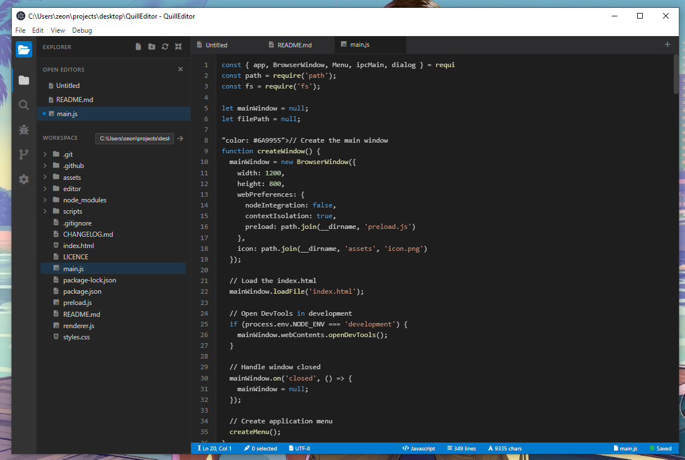

# QuillEditor


A lightweight code editor built with Electron.

A **lightweight, cross‑platform desktop code editor** built with **Electron**, designed for developers who want a **fast, distraction‑free coding environment**. QuillEditor focuses on the essentials: write code, save files, debug, repeat — without the overhead and noise of large IDEs.



---

## ✨ Why QuillEditor?

Modern editors are powerful, but often overwhelming. QuillEditor is built around a simple idea:

> **An editor should get out of your way.**

No heavy plugins, no bloated UI, no lag. Just a clean workspace that lets you focus on writing and understanding code.

---

## 🚀 Features

- **Lightweight & Fast**
  Optimized for performance, even when working with large files or low‑resource systems.

- **Syntax Highlighting**
  Built‑in support for popular languages such as:
  - JavaScript
  - HTML
  - CSS
  - Python
  - JSON (and more planned)

- **File Explorer**
  Tree‑view file explorer with basic file and folder operations.

- **Tabbed Editing**
  Open and work on multiple files simultaneously with an intuitive tab system.

- **Modern UI**
  Clean, minimal interface designed for clarity and focus.

- **Cross‑Platform**
  Runs on Windows, macOS, and Linux via Electron.

---

## 🛠️ Tech Stack

- **Electron** – Desktop application framework
- **HTML, CSS, JavaScript** – Core UI and logic
- **Node.js** – File system and system‑level operations

---

## 📦 Installation

### Option 1: Download a Release

1. Go to the **Releases** page:
   👉 [https://github.com/004Ongoro/quilleditor/releases](https://github.com/004Ongoro/quilleditor/releases)
2. Download the installer for your operating system.
3. Install and start coding.

### Option 2: Run from Source (Development)

```bash
# Clone the repository
git clone https://github.com/004Ongoro/quilleditor.git

# Navigate into the project directory
cd quilleditor

# Install dependencies
npm install

# Start the app
npm start
```

> Make sure you have **Node.js** and **npm** installed before running the project.

---

## 🧪 Development Workflow

- **`main.js`** – Electron main process
- **`preload.js`** – Secure bridge between Node.js and the renderer
- **`renderer.js`** – UI logic and editor interactions
- **`index.html` / `styles.css`** – Application UI

CI pipelines are set up using **GitHub Actions** for:

- Development builds
- Production releases

---

## 🧭 Roadmap (Planned Features)

- [ ] Built‑in debugger improvements
- [ ] Search & replace
- [ ] Custom themes (light / dark / minimal)
- [ ] Keyboard shortcuts
- [ ] Language‑specific enhancements
- [ ] Plugin or extension system (lightweight)

---

## 🤝 Contributing

Contributions are welcome!

1. Fork the repository
2. Create a new feature branch
3. Commit your changes
4. Open a Pull Request

If you have ideas, suggestions, or bug reports, feel free to open an **issue**.

---

## 📄 License

This project is licensed under the **MIT License** — you are free to use, modify, and distribute it.

---

## 👤 Author

**George Ongoro**
Software Engineer • Builder • Minimalist Tools Advocate

- GitHub: [https://github.com/004Ongoro](https://github.com/004Ongoro)
- Website: [https://ongoro.top](https://ongoro.top)

---

> _QuillEditor — write code, not distractions._ ✍️
